## External Dependencies

### Imports

* `csv` — CSV writing utilities (`csv.DictWriter`, `csv.QUOTE_MINIMAL`).
* `os` — filesystem helpers (`abspath`, `dirname`, `makedirs`, `path.isfile`).
* `typing.Any`, `typing.Dict`, `typing.Iterable` — type annotations for inputs and field lists.

## Module-level Constants and Variables

### Constants

* `RESULT_FIELDNAMES: list[str]`
  Canonical column order used when writing result rows. Intended to keep CSV output stable across runs.

  Fields:

  * `path` — analyzed file path.
  * `status` — final label/status string (e.g., “Likely ORIGINAL”, “Likely UPSCALED …”, “Inconclusive …”).
  * `confidence` — numeric confidence in `[0, 1]` (string-formatted when written).
  * `elapsed_s` — elapsed wall time for processing (string-formatted when written).
  * `samplerate_hz` — audio samplerate in Hz.
  * `num_samples` — total number of samples in the decoded audio stream.
  * `num_total_frames` — total frames considered by the analysis stage (before silence dropping).
  * `num_non-silent_frames` — number of frames remaining after silence / invalid-frame filtering.
  * `effective_cutoff_hz` — cutoff actually used for the file (after Nyquist clamping, computed elsewhere).
  * `per_cutoff_active_fraction` — optional serialized structure containing active fractions per probed cutoff.

### Key runtime variables (created/used by the module’s functions)

* `csv_path: str`
  Destination path for the CSV output file.

* `result: dict[str, Any]`
  Input record with analysis outputs (may include additional keys beyond `RESULT_FIELDNAMES`).

* `fieldnames: Iterable[str]`
  Output column list used to flatten and order the row. Defaults to `RESULT_FIELDNAMES`.

* `parent_dir: str`
  Resolved directory containing `csv_path`, derived from `dirname(abspath(csv_path))`.

* `file_exists: bool`
  Whether the output CSV already exists (`os.path.isfile(csv_path)`).

* `row: dict[str, Any]`
  Flattened row where each output field maps to `result.get(field, "")`.

* `writer: csv.DictWriter`
  CSV writer configured with stable field order, minimal quoting, and “ignore” policy for extra keys.

## Additional Information

### Directory creation policy (moved from code comments)

Before appending, `append_result_to_csv()` ensures the destination directory exists:

* The directory is computed as:

  * `parent_dir = os.path.dirname(os.path.abspath(csv_path))`

* The module then attempts:

  * `os.makedirs(parent_dir, exist_ok=True)`

Purpose:

* Allows writing to nested paths (e.g., `outputs/results/run_01.csv`) without requiring the caller to pre-create directories.

Note:

* The intent is “create the parent directory if needed, but don’t error if it already exists.”
  (In practice, `abspath()` + `dirname()` always yields a directory path; the guard is a defensive check.)

### Stable row shaping and missing fields

The CSV row is intentionally constructed as a *flat* mapping with a fixed column order:

```
row = {k: result.get(k, "") for k in fieldnames}
```

Effects:

* Any missing key becomes an empty string (`""`) in the CSV cell.
* Only fields listed in `fieldnames` are written, ensuring output schemas remain consistent across runs.

### Numeric formatting normalization

For readability and stable diffs, two fields are normalized when they are numeric (`int` or `float`):

* `confidence` → formatted to 6 decimals: `"{:.6f}"`
* `elapsed_s` → formatted to 6 decimals: `"{:.6f}"`

If either value is not numeric (e.g., already a string or missing), it is left unchanged.

### Header-writing behavior

The function appends rows to `csv_path` in `"a"` (append) mode.

* If the file does **not** exist, it writes a header row first (`writer.writeheader()`).
* Otherwise it writes only the row.

This makes the function safe to call repeatedly for incremental logging across many files.

### Extra keys in `result`

`csv.DictWriter(..., extrasaction="ignore")` prevents failures when `result` contains additional keys beyond `fieldnames`.

This allows upstream code to attach debugging or intermediate metadata to `result` without changing the CSV schema.

## Module Workflow (call graph)

```mermaid
flowchart TD
    classDef ok fill:#20462d,stroke:#2e7d32;

    M["data_and_error_logging.py"]:::ok
    F_app["append_result_to_csv()"]:::ok
    M --> F_app
```



## Function Inventory

* `append_result_to_csv(csv_path, result, fieldnames=RESULT_FIELDNAMES)`
