## External Dependencies

### Imports

* `numpy` — array coercion, percentiles/means, and numeric utilities (`np.asarray`, `np.percentile`, `np.mean`, `np.clip`).

## Module-level Constants and Variables

### Constants

* `ENERGY_RATIO_THRESHOLD: float = 1e-3`
  Per-frame threshold above which a frame is considered to contain meaningful high-frequency (HF) energy (relative to a cutoff).

* `MIN_ACTIVE_FRACTION: float = 0.05`
  If at least 5% of valid frames are “active”, the file is classified as **Likely ORIGINAL**.

* `RATIO_DROP_THRESHOLD: float = 1e-5`
  Frames below this ratio are treated as near-silent / invalid and are excluded from the active-fraction calculation.

### Constants (confidence shaping)

* `ORIGINAL_CONFIDENCE_GAMMA: float = 1.0`
  Exponent applied to the normalized distance above `MIN_ACTIVE_FRACTION` when computing confidence for **Likely ORIGINAL**.

### Constants (bitrate / cutoff profiling)

* `MAX_HF_ACTIVE_FRACTION_FOR_CUTOFF = 0.02`
  A probed cutoff is considered “quiet” if at most 2% of frames are active above it.

* `MIN_PREV_CUTOFF_ACTIVE_FRACTION = 0.2`
  The previous (lower) cutoff must be “loud” (≥20% active frames) to confirm an elbow when selecting the first quiet cutoff.

* `LOSSY_CUTOFF_PROFILES: dict[int, int]`
  Mapping of cutoff Hz → expected lossy bitrate (kbps) upper bound used for “Likely UPSCALED” labeling.

* `PROBE_CUTOFFS_HZ: list[int]`
  Sorted list of candidate cutoffs derived from `LOSSY_CUTOFF_PROFILES`.

### Key runtime variables (created/used by functions)

* `ratios: array-like[float]`
  Per-frame HF energy ratios measured **above `effective_cutoff`**.

* `effective_cutoff: float`
  Probe cutoff in Hz used to compute `ratios` (typically clamped below Nyquist elsewhere).

* `frame_energy_above_cutoff_ratios: np.ndarray`
  `ratios` coerced to `float` and filtered to exclude near-silent frames.

* `active_fraction: float`
  Fraction of remaining frames whose ratio exceeds `ENERGY_RATIO_THRESHOLD`.

* `frame_ffts: list[FrameFFT] | None`
  Optional cached FFT artifacts per frame (must provide `freqs_hz`, `spectrum_abs`, `total_energy`).

* `per_cutoff_fractions: dict[int, float]`
  For each probed cutoff, the computed active fraction using cached FFTs (no re-FFT).

## Additional Information

### Per-frame ratio semantics (HF energy above a cutoff)

The primary input signal to this module is a per-frame ratio:

```
ratio = (energy_above_cutoff_hz) / (total_frame_energy)
```

Where:

* `energy_above_cutoff_hz` is computed by summing FFT magnitudes in bins whose center frequency is **strictly above** the chosen cutoff.
* `total_frame_energy` is the sum of FFT magnitudes across all bins (or an equivalent total measure), used as the denominator.

Expected properties:

* `ratio` is dimensionless and typically lies in `[0, 1]` for valid frames.
* `ratio ≈ 0` implies little or no meaningful HF content above the cutoff for that frame.
* Larger ratios imply increasing HF presence above the cutoff.

### `debug_energy_ratios()` statistics (moved from code comments)

`debug_energy_ratios(ratios)` computes summary statistics over per-frame HF ratios corresponding to a *single cutoff*.

Computed values:

* `hf_ratio_min` — minimum ratio across frames.
* `hf_ratio_p90`, `hf_ratio_p95`, `hf_ratio_p99` — percentile cutoffs capturing “spikiness” of HF activity.
  *Example:* `hf_ratio_p99` is the value such that only 1% of frames exceed it.
* `hf_ratio_max` — maximum ratio (useful for spotting rare noisy frames).
* `hf_ratio_mean` — arithmetic mean ratio (coarse overall HF presence proxy).

Operational notes:

* This function assumes the caller already computed ratios for a specific cutoff frequency.
* If you drop silent frames elsewhere, apply that policy consistently before calling this so percentiles remain comparable.

### Silence / invalid-frame handling

`determine_file_status()` drops near-silent frames early:

* Any frame with `ratio <= RATIO_DROP_THRESHOLD` is excluded from downstream “active” computations.
* If no frames remain, the function returns:

  * `"Likely UPSCALED (no significant frames)"`, confidence `0.0`.

In the cache-based path (`_active_fraction_from_cache()`), frames are also excluded when:

* `total_energy <= 0`
* required FFT fields are missing (`freqs_hz`, `spectrum_abs`)
* arrays are empty

This ensures active-fraction estimates are based only on frames with usable FFT content.

### Classification logic: ORIGINAL vs UPSCALED

The core decision in `determine_file_status()`:

1. Convert `ratios` to float array.
2. Drop near-silent frames (`> RATIO_DROP_THRESHOLD`).
3. Compute:

```
active_fraction = mean(ratio > ENERGY_RATIO_THRESHOLD)
```

Decision:

* If `active_fraction >= MIN_ACTIVE_FRACTION` → return `"Likely ORIGINAL"` with confidence computed from how far above threshold it is.
* Otherwise → attempt bitrate/cutoff estimation **only if** `frame_ffts` is provided; else return an inconclusive label.

### Confidence shaping for “Likely ORIGINAL”

When `active_fraction = x` exceeds `MIN_ACTIVE_FRACTION = t`, confidence is:

```
z = (x - t) / (1 - t)   # maps x ∈ [t, 1] to z ∈ [0, 1]
confidence = z ** ORIGINAL_CONFIDENCE_GAMMA
```

Interpretation:

* Confidence is 0 exactly at the threshold (`x == t`).
* Confidence approaches 1 as `x → 1`.
* `ORIGINAL_CONFIDENCE_GAMMA > 1` makes confidence rise more slowly near the threshold and faster only with stronger evidence.

### Cache-based bitrate / cutoff estimation (elbow detection)

If the file is not classified as original and `frame_ffts` is available, the module probes multiple candidate cutoffs:

1. For each cutoff `c` in ascending `probe_list`, compute an “active fraction” above `c` using cached FFTs (no recomputation).
2. Select the **first cutoff** that is “quiet”:

* quiet if `frac(c) <= MAX_HF_ACTIVE_FRACTION_FOR_CUTOFF`

And confirm an “elbow” when possible:

* if `c` is not the first cutoff, require previous cutoff activity:
  `frac(prev_c) >= MIN_PREV_CUTOFF_ACTIVE_FRACTION`

Fallback behavior:

* If no elbow is found but some quiet cutoffs exist, select the **lowest** quiet cutoff as a conservative upper bound.
* If no quiet cutoff exists, return `(None, None, per_cutoff_fractions)`.

Labeling:

* If a cutoff is selected and exists in `LOSSY_CUTOFF_PROFILES`, return:
  `"Likely UPSCALED from <= {kbps} kbps"`

Confidence for this branch is:

```
confidence = clip(1.0 - selected_frac, 0.0, 1.0)
```

## Module Workflow (call graph)

```mermaid
flowchart TD
    classDef ok fill:#20462d,stroke:#2e7d32;

    M["file_status_determination.py"]:::ok
    F_det["determine_file_status()"]:::ok
    F_dbg["debug_energy_ratios()"]:::ok
    F_est["_estimate_bitrate_from_cache()"]:::ok
    F_act["_active_fraction_from_cache()"]:::ok

    M --> F_det
    M --> F_dbg
    F_det --> F_est
    F_est --> F_act
```



## Function Inventory

* `debug_energy_ratios(ratios)`
* `determine_file_status(ratios, effective_cutoff, frame_ffts=None, probe_cutoffs_hz=None)`
* `_estimate_bitrate_from_cache(frame_ffts, effective_cutoff, energy_ratio_threshold, ratio_drop_threshold, probe_cutoffs_hz=None)`
* `_active_fraction_from_cache(frame_ffts, cutoff_hz, energy_ratio_threshold, ratio_drop_threshold)`
