## External Dependencies

### Imports

* `os` — filesystem checks (`os.path.isfile`, `os.path.isdir`).
* `sys` — command-line argument access (`sys.argv`).

### Internal module imports

* `run_modes.run_single_file` — processes a single FLAC file (optionally verbose and with spectrogram).
* `run_modes.run_folder_batch` — processes all FLAC files found recursively in a folder and writes a timestamped CSV.

## Module-level Constants and Variables

### Key runtime variables (created/used by the module’s functions)

* `sys.argv: list[str]`
  Command-line arguments passed to the program.

* `path: str`
  User-provided path from `sys.argv[1]`. May point to a `.flac` file or a directory.

## Additional Information

### Help and argument validation

The program enforces a minimal CLI contract:

* If fewer than 2 arguments are provided (`len(sys.argv) < 2`), it prints an error hint and exits.
* If the first argument is `help`, it prints a usage string and exits.

The usage guidance instructs quoting the file path to avoid shell parsing issues.

## Module Workflow (call graph)

```mermaid
    flowchart TD
    classDef ok fill:#20462d,stroke:#2e7d32;
    classDef err fill:#a1362a,stroke:#c62828;

    F_main["main()"]:::ok

    C_argc{"len(sys.argv) < 2 ?"}:::ok
    E_args["print error<br/>return"]:::err

    C_help{"sys.argv[1] == 'help' ?"}:::ok
    E_help["print usage<br/>return"]:::ok

    S_path["path = sys.argv[1]"]:::ok

    C_file{"os.path.isfile(path)<br/>AND path.lower().endswith('.flac') ?"}:::ok
    A_single["run_single_file(path,<br/>want_verbose=True,<br/>want_spectrogram=True)"]:::ok

    C_dir{"os.path.isdir(path) ?"}:::ok
    A_batch["run_folder_batch(path)"]:::ok

    E_inv["print invalid path / not .flac<br/>return"]:::err

    F_main --> C_argc
    C_argc -->|"True"| E_args
    C_argc -->|"False"| C_help

    C_help -->|"True"| E_help
    C_help -->|"False"| S_path

    S_path --> C_file
    C_file -->|"True"| A_single
    C_file -->|"False"| C_dir

    C_dir -->|"True"| A_batch
    C_dir -->|"False"| E_inv
```

## Function Inventory

* `main()`
