## External Dependencies

### Imports

* `time` — wall-clock timing (`time.time()`).
* `os` — filesystem traversal and path joining (`os.walk`, `os.path.join`).
* `typing.Any`, `typing.Dict`, `typing.Final`, `typing.List`, `typing.Optional` — type annotations and `Final`.
* `tqdm.tqdm` — progress bar for batch runs.
* `datetime.datetime` — timestamped CSV naming (`datetime.now()`, `strftime()`).

### Internal module imports

* `audio_frame_analysis.analyze_frame` — per-frame HF ratio computation (optionally caches FFT artifacts).
* `audio_frame_analysis.divide_into_frames` — splits audio into overlapping frames.
* `audio_frame_analysis.calculate_effective_cutoff` — computes file-specific cutoff clamped below Nyquist.
* `audio_loader.load_flac` — loads FLAC data and samplerate.
* `spectrogram_generator.spectrogram_for_flac` — optional spectrogram generation for the input file.
* `file_status_determination.determine_file_status` — classifies ORIGINAL/UPSCALED and may estimate lossy cutoff profile when FFT cache is present.
* `data_and_error_logging.append_result_to_csv` — appends per-file results to a CSV file.

## Module-level Constants and Variables

### Constants

* `RESULT_FIELDNAMES: Final[list[str]]`
  Canonical schema used to construct the result dictionary. Intended to keep keys stable across logging and downstream tooling.

  Fields:

  * `path` — input file path.
  * `status` — classification label or error/inconclusive status.
  * `confidence` — confidence in `[0, 1]` (numeric; formatting is handled by CSV writer).
  * `elapsed_s` — processing duration for the file (seconds).
  * `samplerate_hz` — samplerate in Hz.
  * `num_samples` — number of samples in the loaded audio array.
  * `num_total_frames` — number of frames produced by `divide_into_frames()`.
  * `num_non-silent_frames` — count of frames whose computed ratio is `> 0`.
  * `effective_cutoff_hz` — effective probe cutoff used for the file.
  * `per_cutoff_active_fraction` — optional per-cutoff activity summary (string for CSV).

### Key runtime variables (created/used by functions)

* `file_path: str` — single FLAC path for analysis.
* `folder_path: str` — root folder for recursive `.flac` discovery.
* `start_time: float`, `elapsed: float` — timestamps for per-file timing.
* `data: np.ndarray`, `samplerate: int | float` — decoded audio samples and samplerate.
* `frames: list[np.ndarray]` — overlapping time-domain frames derived from `data`.
* `effective_cutoff_hz: float` — cutoff computed once per file from `samplerate`.
* `fft_cache: list` — per-frame FFT artifacts collected during `analyze_frame()` for reuse in bitrate estimation.
* `ratios: list[float]` — per-frame energy-above-cutoff ratios.
* `status: str`, `confidence: float`, `fractions: dict[float, float] | None` — classification outputs; `fractions` holds per-cutoff active fractions when available.
* `csv_path: str` — output CSV path (named with a timestamp inside `folder_path`).
* `flac_file_paths: list[str]` — discovered FLAC files for batch processing.

## Additional Information

### CSV schema stability and “key drift” prevention

`run_single_file()` constructs `result` by first creating an empty dict with the canonical schema:

```
result = {k: "" for k in RESULT_FIELDNAMES}
```

Then overlays computed values via `result.update(...)`.

Purpose:

* Guarantees all expected columns exist for every row, even when some values are missing.
* Avoids accidental schema divergence when upstream code adds/removes keys over time.
* Keeps `append_result_to_csv()` output consistent (especially in batch mode).

If the file is not confidently original, `determine_file_status()` can use `frame_ffts` to estimate an elbow cutoff profile and return `fractions` (per-cutoff active fractions).

### Per-cutoff fractions serialization for CSV

`_format_fractions_for_csv()` turns a mapping `{cutoff_hz: active_fraction}` into a single string:

* Format: `"13000=0.8123;16000=0.4550;20500=0.0123"`
* Cutoffs are sorted ascending.
* Values are formatted to 4 decimals.

### Batch folder mode: discovery, processing, and error fallback

`run_folder_batch(folder_path)`:

1. Creates a timestamped output CSV path inside the folder:

   * `YYYY-Month-DD__HH-MM-SS.csv`
2. Recursively walks the folder and collects `.flac` files.
3. Iterates files with a `tqdm` progress bar and calls `run_single_file()` with verbosity and spectrogram disabled.
4. On exceptions, records a minimal error row:

   * `{"path": flac_file_path, "status": "ERROR"}`
5. Appends each result row to the batch CSV via `append_result_to_csv()`.

## Module Workflow (call graph)

```mermaid
flowchart TD
    classDef ok fill:#20462d,stroke:#2e7d32;

    M["run_modes.py"]:::ok
    F_fmt["_format_fractions_for_csv()"]:::ok
    F_single["run_single_file()"]:::ok
    F_batch["run_folder_batch()"]:::ok

    M --> F_fmt
    M --> F_single
    M --> F_batch

    F_single --> A_load["load_flac()"]:::ok
    F_single --> A_div["divide_into_frames()"]:::ok
    F_single --> A_cut["calculate_effective_cutoff()"]:::ok
    F_single --> A_af["analyze_frame()"]:::ok
    F_single --> A_det["determine_file_status()"]:::ok
    F_single --> A_spec["spectrogram_for_flac()"]:::ok

    F_batch --> A_walk["os.walk()"]:::ok
    F_batch --> F_single
    F_batch --> A_csv["append_result_to_csv()"]:::ok
```



## Function Inventory

* `_format_fractions_for_csv(fractions)`
* `run_single_file(file_path, want_verbose, want_spectrogram)`
* `run_folder_batch(folder_path)`
