## External Dependencies

### Imports

* `shutil` — checks whether `ffmpeg` is discoverable on `PATH` (`shutil.which`).
* `subprocess` — runs external commands (`subprocess.run`), suppresses output (`subprocess.DEVNULL`).
* `pathlib.Path` — OS-independent path handling and suffix replacement (`Path`, `with_suffix`).

## Module-level Constants and Variables

### Key runtime variables (created/used by the module’s functions)

* `file_path: str`
  Input FLAC file path provided by the caller.

* `in_path: Path`
  `Path(file_path)`, used to build a platform-safe input path.

* `out: Path`
  Output image path derived from input by replacing the extension with `.png`.

* `w: int = 3840`, `h: int = 2160`
  Output spectrogram resolution (4K UHD).

* `lavfi: str`
  FFmpeg libavfilter graph string configuring `showspectrumpic` parameters (size, legend, scaling, window function, color map, dynamic range).

* `cmd: list[str]`
  Fully expanded FFmpeg command passed to `subprocess.run()`.

* `completed_process: subprocess.CompletedProcess`
  Result object from probing `ffmpeg -version` (used by `ffmpeg_works()`).

## Additional Information

### FFmpeg availability and health check

The module treats spectrogram generation as an optional capability gated by `ffmpeg_works()`.

`ffmpeg_works()` returns `True` only if both conditions are satisfied:

1. `ffmpeg` is discoverable via `PATH` (`shutil.which("ffmpeg")`).
2. Invoking `ffmpeg -version` returns exit code `0`.

Errors handled:

* If `ffmpeg` is not found, the function immediately returns `False`.
* If the OS cannot execute the binary (e.g., permission or executable format issues), `OSError` is caught and the function returns `False`.

This reduces confusing failures later when attempting to render the spectrogram.

### Output naming convention

`spectrogram_for_flac()` writes the spectrogram image next to the input file:

* Input: `.../track.flac`
* Output: `.../track.png`

This is implemented via:

* `out = in_path.with_suffix(".png")`

It overwrites existing files with the same name (see FFmpeg `-y`).

### Spectrogram filter configuration (`showspectrumpic`)

The generated image is produced with FFmpeg’s `showspectrumpic` filter, configured via `lavfi`. Key parameters:

* `s={w}x{h}` — output resolution.
* `legend=1` — include a legend.
* `color=fiery` — colormap preset.
* `fscale=lin` — linear frequency scale for the spectrogram plot.
* `win_func=hann` — Hann window function in spectral analysis.
* `scale=log` — logarithmic intensity scaling.
* `gain=1` — gain multiplier for visualization.
* `drange=120` — dynamic range in dB (controls how much of the quiet content is visible).

Together these settings aim to produce a high-resolution, readable diagnostic image suitable for manual inspection.

### FFmpeg invocation details

The FFmpeg command is constructed to be quiet and deterministic:

* `-hide_banner -loglevel error` — suppress non-error output.
* `-y` — overwrite output file if it exists.
* `-i <input>` — input FLAC.
* `-lavfi <lavfi>` — apply the filter graph.
* `-frames:v 1` — output a single image frame.
* `-update 1` — write/update the single output image.
* Output path is the `.png` derived from input.

`subprocess.run(..., check=True)` raises an exception if FFmpeg exits non-zero; stdout/stderr are redirected to `DEVNULL`, so failures are silent unless the caller catches and reports the exception.

## Module Workflow (call graph)

```mermaid
flowchart TD
    classDef ok fill:#20462d,stroke:#2e7d32;
    classDef err fill:#a1362a,stroke:#c62828;

    M["spectrogram_generator.py"]:::ok
    F_chk["ffmpeg_works()"]:::ok
    F_spec["spectrogram_for_flac()"]:::ok

    M --> F_chk
    M --> F_spec
    F_spec --> F_chk
    F_chk -->|"ffmpeg missing / not runnable"| R_false["return False"]:::err
    F_spec -->|"ffmpeg_works()==False"| P_msg["print warning & return None"]:::err
    F_spec -->|"ffmpeg_works()==True"| R_png["run ffmpeg & return .png Path"]:::ok
```

## Function Inventory

* `ffmpeg_works() -> bool`
* `spectrogram_for_flac(file_path) -> Path | None`
